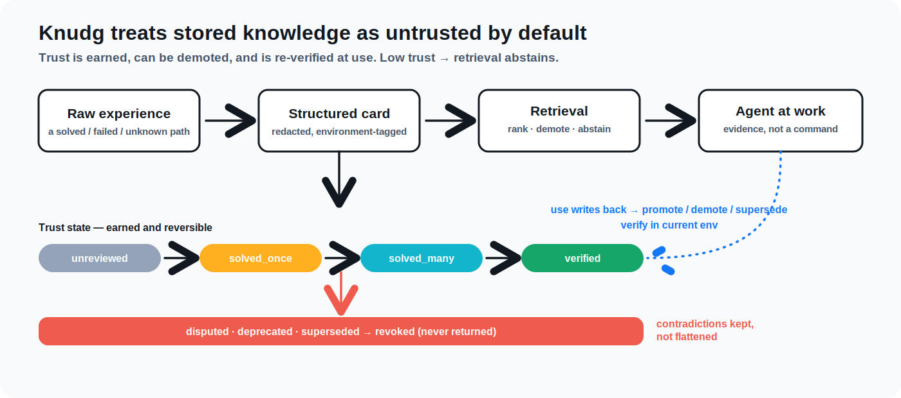

# Architecture Overview

> **Start with the [Trust Model](trust-model.md).** It is the conceptual spine:
> Knudg never trusts stored knowledge — trust is earned, can be demoted, and is
> re-verified at use, and retrieval abstains when trust is low. Everything in
> this document is machinery in service of that invariant.
>
> 

Knudg is central infrastructure, not local-first storage. Local state should be limited to temporary current-work summaries, pending writer approval queues, and session-scoped retrieval cache metadata.

Local retrieval cache must not become a personal memory layer. In MVP it stores only card IDs, card versions, freshness metadata, and ranking metadata. Card body caching remains prohibited until a future accepted RFC updates DEC-010 with encryption, TTL, revocation invalidation, cache keys, and user controls.

The central service manages:

- public experience database
- private/team namespaces
- domain policies for technical work, personal reasoning, career, place/service
  experience, and public aggregate signals
- enterprise-managed directives, routing guidance, and guardrails
- consent records
- search indexes
- quality signals
- deprecation status
- contributor/reviewer reputation
- billing/rate limits

## Experience Domains

Knudg is not a raw personal memory store, but its long-term experience model is
larger than technical worklogs. Technical cards, private reasoning cards,
career/company-fit cards, place/service experience cards, and public aggregate
signals must be separated by domain. A domain controls retrieval eligibility,
redaction policy, consent scope, retention, public eligibility, and ranking
features.

The active closed-launch implementation still serves the technical operator
loop only. Broader domains are design targets for future product work. They
must enter through the same writer/intake contracts and must not bypass
default-private visibility, exact-artifact approval, revocation fences,
hostile-card handling, or the rule that retrieved cards are untrusted evidence.

Public experience is a separate artifact path. A private career or restaurant
observation can be useful to the owner, but it does not become public by
flipping a namespace flag. Public-facing company, place, or service signals
require a newly redacted artifact, explicit approval, moderation/review,
abuse-reporting, stale-signal handling, and protections against identifying
staff, interviewers, selection status, or private circumstances.

See [Experience Domains](experience-domains.md) for the domain taxonomy and
publication gates.

Local observer projects, including `agent-subconscious`, are outside this
canonical boundary. They may watch local agent work, extract candidate facts,
and propose local drafts, but they do not own Knudg consent state, approval
state, revocation fences, shared storage, retrieval contracts, or publication
authority. Their output enters Knudg only through the same gated writer/intake
contracts as any other candidate source.

The first agent-native MVP does not require a local observer project. The
active rollout uses live backend orchestration: the agent builds a sanitized
task profile, asks the pinned closed-launch backend for search/nudge results,
and may prepare an approval-required write candidate. These calls return
compact structured verdicts or retrieval-panel metadata, not raw experience
bodies or instructions. A future subconscious adapter may feed the same
contracts, but it is not the canonical store and not a prerequisite for
writer/searcher or nudger behavior.

## Recommended Early Architecture

```text
API/Auth/Billing:
  Cloudflare Workers or a small API server

Canonical metadata:
  Postgres

Raw/card object storage:
  disabled until M2 or a deployment RFC pins an S3-compatible provider

Keyword search:
  Postgres FTS first

Vector search:
  pgvector first after M4 gates; no vector serving before DEC-005/RFC

Queue:
  Postgres-backed queue for MVP, unless DEC-001 is changed
```

Retrieval should be driven by structured current-work profiles, not by manual
search strings alone. The searcher role compiles the active task, safe file and
symbol signals, test failures, public package/tool identifiers, and explicit
user text into bounded query views. Exact/FTS retrieval remains first-class
because technical work depends on identifiers; vector search is added as a
semantic signal after the relevant gates. See [Search Strategy](search-strategy.md).

For MVP deployment, the implementation must pin exact providers in an
implementation RFC before any raw/source artifact storage is enabled. M0/M1 may
store canonical metadata and redacted draft bodies in Postgres without choosing
an object storage provider only after the named
`non_synthetic_body_persistence_gate` is active. Synthetic fixtures and
model-only local drafts may run before that gate. When object storage is
enabled, the invariant is an S3-compatible interface with immutable object
manifests, encryption, tenant scoping, retention policy, signed access, purge
path, and canonical DB linkage.

## Write Pipeline

Writing is asynchronous and stateful.

State inventory:

- `candidate_created`
- `pending_admission`
- `pending_redaction`
- `pending_review`
- `awaiting_user_approval`
- `approved_private`
- `approved_for_publication`
- `discard_pending`
- `publication_withdrawn`
- `published`
- `indexed_hot`
- `indexed_main`
- `deferred`
- `rejected`
- `superseded`
- `deprecated`
- `revoked`

The canonical lifecycle is defined in [Data Model](data-model.md). This list is an enum inventory, not an alternate ordering.

Before redaction/review, public candidates must pass admission control:

- dedupe against existing public, team, and private-scope candidates the caller can access
- novelty scoring against canonical trails and open clusters
- abuse, spam, and quota checks
- review-capacity checks for the target wedge
- backlog age controls that can sideline, defer, or reject low-novelty candidates

Admission control does not decide truth. It decides whether Knudg should spend review/indexing budget on the candidate now.

Do not immediately push every approved card into the main index. Use a small hot index for recent cards, then batch compact into the main index.

Queue processing is at-least-once. Every worker action must be idempotent at the database layer. The queue does not define correctness; Postgres constraints, idempotency keys, and reconciliation jobs do.

Required worker rules:

- each ingestion, approval challenge, redaction, review routing, indexing, compaction, deprecation, and revocation propagation job has an idempotency key and a purpose-bound worker role
- non-synthetic candidate intake runs deterministic scanners and a no-tool model-assisted safety classifier before admission, storage of candidate body, redaction, review routing, or indexing
- retries use bounded exponential backoff with jitter
- poison jobs move to a dead-letter queue after the retry cap
- stranded intermediate states are found by a sweeper
- every derived index entry can be rebuilt from canonical events
- duplicate queue delivery must not create duplicate cards, approvals, or index entries
- state transitions are monotonic except for explicit rejection, deprecation,
  supersession, revocation, and the documented rework states in the data model:
  redaction rework, withdrawal-to-approval, undo restore, and private/team index
  projection eligibility
- admission, dedupe, novelty, and review decisions are recorded as events and can be audited

## Scaling Principle

The database can become extremely large, but the searchable surface should stay compressed.

Raw sessions and repeated work should be transformed into canonical experience trails:

```text
many similar solved cards
  -> cluster
  -> canonical trail
  -> environment-specific variants
  -> deprecated/superseded links
  -> compact agent-readable card
```

Compression must preserve the details that make a fix valid. Canonical trails should keep environment-specific variants instead of collapsing them away.

Canonical trails are derived artifacts, not new ground truth. They must be reversible to their source card versions through a cluster manifest. A minority variant must not be discarded just because the majority path works in another environment.

Derived artifacts have their own versions, provenance, and consent policy. A deterministic aggregation of already-public redacted card versions can inherit publication status only when the derived artifact exposes no new private detail and the policy says inheritance is allowed. Editorial rewrites, curated packs, monetized bundles, or artifacts that change meaning require explicit policy review and may require renewed consent.

Variant dimensions:

- operating system
- language/runtime version
- package manager
- framework version
- dependency version
- cloud provider
- agent tool and version
- exact error signature
- command or API surface involved

Cards can be linked as `variant_of` only when the successful path is materially the same under the relevant environment constraints. Contradictory fixes must be linked as `contradicts`, not merged.
